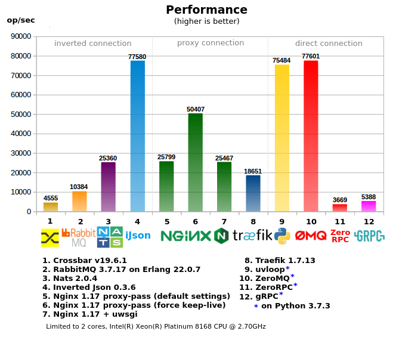

### Inverted Json
Inverted Json is a job server which helps you to organize RPC communication between clients and workers. It helps to save time and resources.
* It's **very fast**, it's built with C/C++ and epoll, it's **7+ time faster** than RabbitMQ for RPC ([look at benchmark](#benchmark)).
* It's **supported by all languages/frameworks**, because it works via http.
* It **uses much less of memory** (and CPU), less than 50+ time than RabbitMQ ([article on medium](https://medium.com/@lega911/rpc-benchmark-and-inverted-json-b5ce0bf587be)).
* Docker image is just **2.6Mb** (slim version)
* API is easy and compact (look at examples, quickstart will be soon)
* It's **a single point of access**: [Client] -> [Inverted Json] <- [Worker] (clients and workers connect to Inverted Json), to simplify the configuration for projects.

#### Benchmark
<a id="benchmark"></a>


<sup>[Multi-core result is here](files/performance9mc.png)</sup>

#### Try Inverted Json in 3 min


[read an article](https://medium.com/@lega911/rpc-benchmark-and-inverted-json-b5ce0bf587be)


#### Example with curl (client + worker)
``` bash
# 1. a worker publishes rpc command
curl -d '{"name": "/test/command"}' localhost:8001/rpc/add

# 2. a client invokes the command
curl -d '{"id": 123, "params": "test data"}' localhost:8001/test/command

# the worker receives {"id": 123, "params": "test data"}
# 3. and sends response with the same id
curl -d '{"id": 123, "result": "data received"}' localhost:8001/rpc/result

# client receives {"id": 123, "result": "data received"}
```

#### Python client
``` python
response = requests.post('http://127.0.0.1:8001/test/command', json={'id': 1, 'params': 'Hello'})
print(response.json())
```

#### Python worker
``` python
while True:
    # get a request
    request = requests.post('http://127.0.0.1:8001/rpc/add', json={'name': '/test/command'}).json()
    
    # send a response
    response = {
        'id': request['id'],
        'result': request['params'] + ' world!'
    }
    requests.post('http://127.0.0.1:8001/rpc/result', json=response)
```
