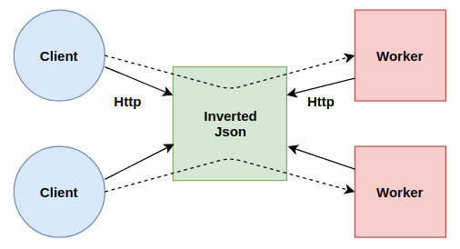
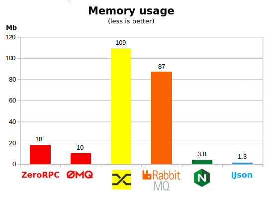

### ijson - inverted json (inverted jsonrpc proxy)



#### Benchmark


<sup>[Multi-core result is here](files/performance_mc.png)</sup>



#### Description
ijson helps to make RPC communication via http where both clients and workers are http-clients.
* It's fast - it based on c++ and epoll
* JsonRPC2 partly supported
* Able to send binary data (not only json)
* Multimethods
* Able to send command on certain worker
* Using Keep-Alive to detect if worker is ok
* Docker image ~9Mb (proxy itself is ~100kb)

#### Start ijson
``` bash
docker run -i -p 8001:8001 lega911/ijson
```

#### Options
``` bash
> ijson
  --host 0.0.0.0:8001  # bind host:port
  --filter 192.168.0.0/24 --filter 70.0.0.0/8  # ip filters for clients
  --log 3  # mask for logs
  --jsonrpc2
```

#### Example with curl (client + worker)
``` bash
# 1. a worker publishes rpc command
curl -d '{"name": "/test/command"}' localhost:8001/rpc/add

# 2. a client invokes the command
curl -d '{"id": 123, "params": "test data"}' localhost:8001/test/command

# the worker receives {"id": 123, "params": "test data"}
# 3. and sends response with the same id
curl -d '{"id": 123, "result": "data received"}' localhost:8001/rpc/result

# client receives {"id": 123, "result": "data received"}
```

#### Python client
``` python
response = requests.post('http://127.0.0.1:8001/test/command', json={'id': 1, 'params': 'Hello'})
print(response.json())
```

#### Python worker
``` python
while True:
    # get a request
    request = requests.post('http://127.0.0.1:8001/rpc/add', json={'name': '/test/command'}).json()
    
    # send a response
    response = {
        'id': request['id'],
        'result': request['params'] + ' world!'
    }
    requests.post('http://127.0.0.1:8001/rpc/result', json=response)
```
